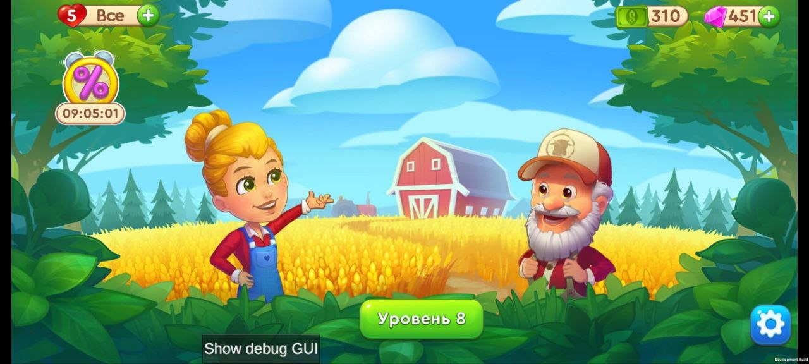
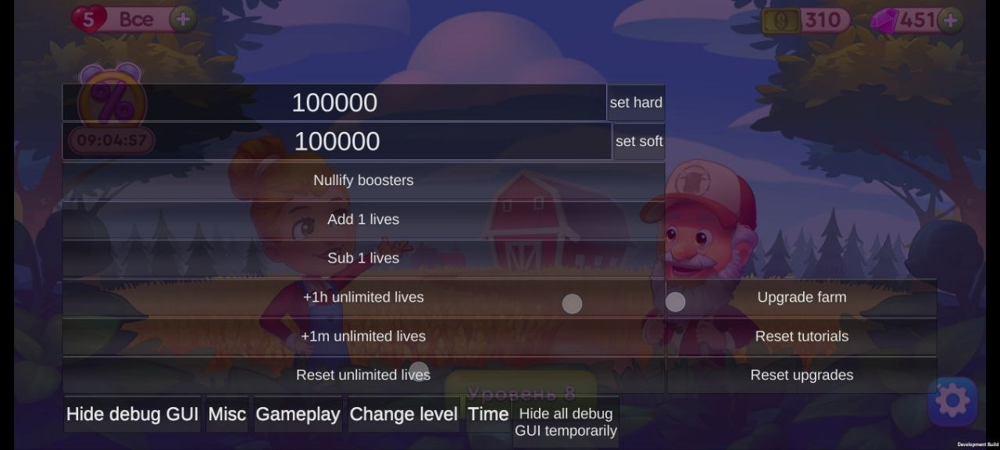

# BUG-001 - Built-in debug/cheat menu accessible to the player ("Show debug GUI")

| Field                 | Value                                       |
| -------------------- | ---------------------------------------------- |
| **Type**             | Security / Dev artifact                        |
| **Severity**         | Critical                                       |
| **Priority**         | High                                           |
| **Status**           | Open                                           |
| **Affects build**    | Test1 (v0.7.0 / code 1700)                     |
| **Environment**      | Xiaomi 12T Pro, Android 15 (API 35), arm64     |
| **Component / Area** | Debug artifacts / Economy / Monetization |
| **Reproducibility**  | Always                                         |

## Steps to reproduce

1. Launch the game, wait for the main menu to load - the label "Show debug GUI" is visible on screen
2. Tap the **"Show debug GUI"** button
3. The debug/cheat panel opens

## Expected result

The build has no player-accessible debug/cheat interface; the player can't arbitrarily change game state.

## Actual result

A full cheat panel opens, allowing you to:

- set hard/soft currency to **100000** (set hard / set soft);
- Add / Sub lives, +1h / +1m unlimited lives;
- Nullify boosters, Upgrade farm, Reset tutorials, Reset upgrades;
- Misc / Gameplay / **Change level** / Time tabs
- etc.

A **"Development Build"** watermark is visible in the bottom-right corner.

## Attachments

## Notes

A dev-build artifact. A direct threat to the economy and monetization (IAP): the player can rack up currency/lives/levels for free. The button isn't hidden - it's accessible right from the game screen. Related to the overall "non-release build" status (investigating the build turned up facts pointing to this: F-01 debuggable build/release, traces of the Lunar Console debug tool, endpoints with "QA" in the address, the Development Build watermark). **Recommendation:** fully remove the debug/cheat GUI and dev flags from the release build.
