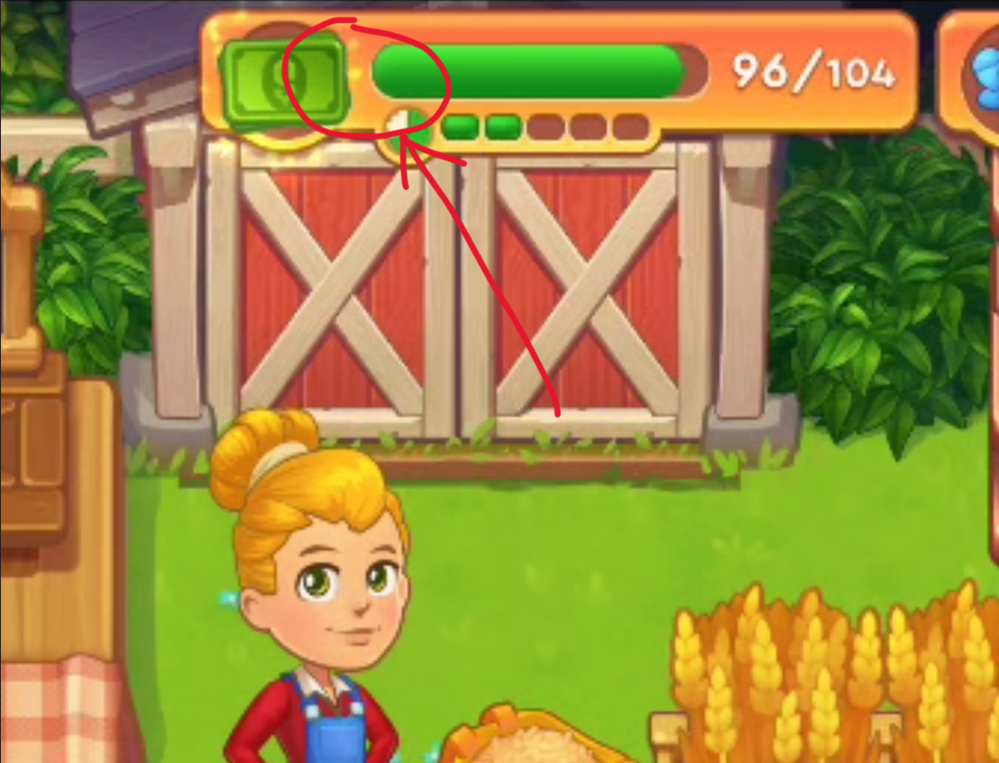

# BUG-002 - Пропал счётчик валюты в HUD (иконка и анимация остаются)

| Поле                 | Значение                                                                                |
| -------------------- | --------------------------------------------------------------------------------------- |
| **Type**             | UI / Visual (HUD)                                                                       |
| **Severity**         | Major                                                                                   |
| **Priority**         | Medium                                                                                  |
| **Status**           | Open                                                                                    |
| **Affects build**    | Test1 (v0.7.0 / code 1700)                                                              |
| **Environment**      | Xiaomi 12T Pro, Android 15 (API 35), arm64                                              |
| **Component / Area** | UI / HUD / счётчик валюты (влияет на видимость баланса)                                 |
| **Reproducibility**  | Sometimes (2 из 10+ запусков, стабильно не воспроизводится) |

## Предусловия

Игра запущена, начат обычный игровой процесс на ферме

## Шаги воспроизведения

> Баг перемежающийся, надёжных шагов нет. Ниже - контекст, при котором возник.

1. Запустить игру, играть на ферме (зарабатывать валюту)
2. В одном из запусков числовой счётчик валюты в HUD отсутствовал с самого начала сессии
3. Перезапуск игры вернул счётчик (обходной путь)

## Ожидаемый результат

Рядом с иконкой валюты в HUD отображается числовой баланс и обновляется при начислении, есть анимация иконки валюты

## Фактический результат

Числовой счётчик валюты отсутствует: иконка-купюра и ее анимация на месте, но **сумма не отображается** - игрок не видит, сколько заработал и сколько у него валюты.

## Вложения

## Заметки

Перемежающийся UI-дефект - доказательство преимущественно визуальное (скринкаст). Рекомендуется скоррелировать с логом по времени пропажи (искать `Exception` / `NullReference` / `currency` / `counter` в момент старта сессии) - возможна ошибка инициализации UI-элемента счётчика. При повторном воспроизведении - уточнить условия (конкретный экран/действие перед появлением).
