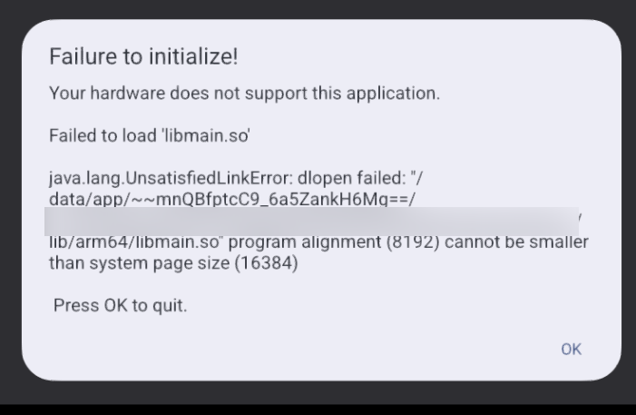
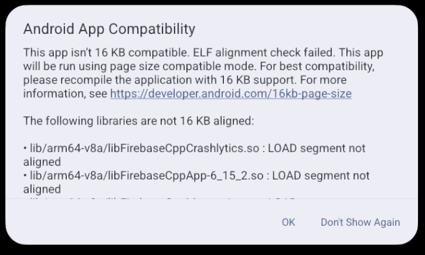
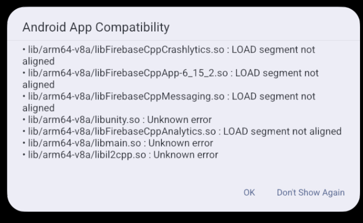

# BUG-009 - Crash on startup on 16 KB page size devices (native .so files aligned for 4 KB) - incompatibility and Google Play risk

| Field                 | Value                                                               |
| -------------------- | ---------------------------------------------------------------------- |
| **Type**             | Compatibility / Store compliance                                       |
| **Severity**         | Major                                                                  |
| **Priority**         | High                                                                   |
| **Status**           | Open                                                                   |
| **Affects build**    | Test1 (v0.7.0 / code 1700); also Test2 per static analysis                       |
| **Environment**      | AVD, Android "16 KB Page Size" image (API 37), x86_64 (ARM translation) |
| **Component / Area** | Native libraries / APK packaging                                     |
| **Reproducibility**  | Always (crash on startup on the 16 KB image)                                |

## Preconditions

Emulator (AVD) on a system image with a **16 KB** memory page size.

## Steps to reproduce

1. Install the Test1 APK on an AVD with the 16 KB image (install succeeds)
2. Launch the game
3. On startup, the system shows an incompatibility warning, then the game **crashes** while loading a native library

## Expected result

Native libraries are aligned for 16 KB, the app launches on 16 KB devices (a Google Play requirement for new and updated apps).

## Actual result

The game **fails to launch** - it crashes on startup:

Before the crash, the system also shows an "Android App Compatibility" dialog listing the libraries not aligned for 16 KB:

Bottom line: on a 16 KB page size device, the app **doesn't start** (alignment 8192 < 16384), the process closes on "OK".

This is also confirmed by the Logcat logs in Android Studio:

[Log screenshot](attachments/BUG-009/Logcat_Screen.png) + [Log text](attachments/BUG-009/logcat_16kb_crash.txt)

## Attachments

- [16 KB incompatibility warning](attachments/BUG-009/16kb_compatibility_dialog_1.png)
- [List of unaligned libraries](attachments/BUG-009/16kb_compatibility_dialog_2.png)
- [Crash: UnsatisfiedLinkError, libmain.so](attachments/BUG-009/16kb_crash_libmain.png)
- [Logcat screenshot](attachments/BUG-009/Logcat_Screen.png)
- [Log text (logcat_16kb_crash.txt)](attachments/BUG-009/logcat_16kb_crash.txt)

## Notes

**Dynamic confirmation of a static finding from Assignment #1** (APK Analyzer: *"Does not support 16 KB devices"*, *"4 KB LOAD section alignment, but 16 KB is required"*). Static analysis and dynamic testing agree: in a real 16 KB environment, this is a **crash on launch**.

On the primary device (Xiaomi 12T Pro, 4 KB pages) the game works - the defect only manifests on 16 KB page size devices. For those devices, severity is effectively **Critical** (the app doesn't launch). Google Play **requires** 16 KB support for new and updated apps (as of November 2025) - this is a **blocker** for publishing/updating.

**Impact on the test run:** this is the only emulator image available in the current environment (Android Studio Quail 1 | 2026.1.1 Patch 2), so the emulator compatibility run is blocked (the smoke test fails at S2 on the 16 KB image).
